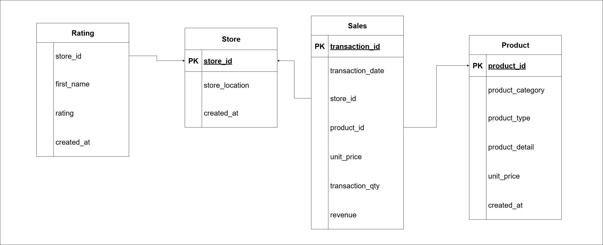
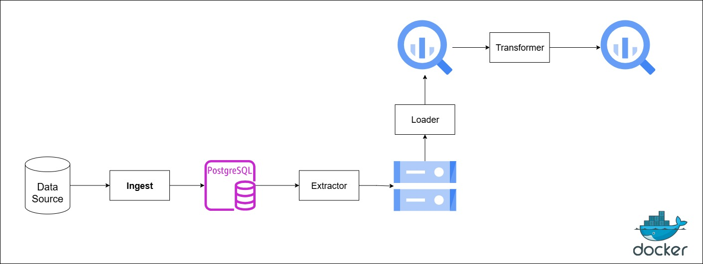

# CAPSTONE PROJECT MODULE 3

### Riki Andrian Nugraha
### JCDEOL 003

Struktur Folder
```
 capstone_project3/
 │-- config/
 │-- dags/             # Folder untuk menyimpan dag
 │-- data/             # Folder untuk menyimpan data di lokal
 │-- logs/       
 │-- plugins/         
 │-- script/           # Folder untuk menyimpan script python
 |-- sql/              # Untuk menyimpan querry sql      

```



## Panduan Penggunaan
1. Tools
- Docker
- VSCode
- Web browser
- Postgres

<br>

2. Cara Setup Program
  - Pastikan sudah mempunyai google service account.
  - Buat folder :"logs", "config", "gcp-creds", "plugins"
  - Pastikan docker sudah aktif.
  - Buat docker image dengan perintah berikut:
```
docker login
docker-compose build
```
<br>

3. Cara Menjalankan Program
  - Jalankan dengan cara:
  
```
docker-compose up
```
  - Masuk ke locallhost:8080
  - Dibagian connection, buat koneksi baru dengan nama google_cloud_default dan untuk Keyfile JSON diisi dengan isi dari google service account
  - Buat lagi koneksi baru dengan nama postgress_default dan isikan data-datanya

<br>
4. Proses Ingest
Pada tahap ingest, masukan ke postgres:

Contoh Implementasi:
```
def load_to_postgres(file_path, table_name, conn_str, date_column, execution_date, next_execution_date, full_load=False):
    try:
        df = pd.read_csv(file_path, parse_dates=[date_column], dayfirst=True)
        df[date_column] = pd.to_datetime(df[date_column], utc=True)

        if isinstance(execution_date, str):
            execution_date = pd.to_datetime(execution_date)
        if isinstance(next_execution_date, str):
            next_execution_date = pd.to_datetime(next_execution_date)

        if full_load:
            filtered_df = df
        else:
            mask = (df[date_column] >= execution_date) & (df[date_column] < next_execution_date)
            filtered_df = df.loc[mask]

        if filtered_df.empty:
            print(f"No data to load for '{table_name}'")
            return

        engine = create_engine(conn_str)
        filtered_df.to_sql(name=table_name, con=engine, if_exists='replace', index=False)

    except FileNotFoundError:
        print(f"File not found: {file_path}")
    except SQLAlchemyError as db_err:
        print(f"DB error: {db_err}")
    except Exception as e:
        print(f"Unexpected error: {e}")
```
<br>
5. Proses Ekstrak
Pada tahap ekstrak, data di load dari postgress ke GCS

Contoh Implementasi:
```
def extract_to_gcs(
    table_name,
    created_column,
    bucket_name,
    dataset_name,
    gcp_conn_id="google_cloud_default",
    execution_date=None,
    full_load=False,  
):
    if execution_date is None:
        execution_date = datetime.today()

    if not full_load:
        # Ambil H-1
        target_date = (execution_date - timedelta(days=1)).date()
        start_time = datetime.combine(target_date, datetime.min.time())
        end_time = datetime.combine(target_date + timedelta(days=1), datetime.min.time())

   
    conn = BaseHook.get_connection("postgres_default")
    POSTGRES_CONN_STR = conn.get_uri()

    if POSTGRES_CONN_STR.startswith("postgres://"):
        POSTGRES_CONN_STR = POSTGRES_CONN_STR.replace("postgres://", "postgresql+psycopg2://", 1)

    if full_load:
        query = f"SELECT * FROM {table_name}"
        temp_path = f"/tmp/{table_name}_full_load.csv"
        gcs_path = f"{dataset_name}/{table_name}.csv"
    else:
        query = f"""
            SELECT * FROM {table_name}
            WHERE {created_column} >= '{start_time}'
              AND {created_column} < '{end_time}'
        """
        temp_path = f"/tmp/{table_name}_{target_date}.csv"
        gcs_path = f"{dataset_name}/{table_name}-{target_date}.csv"

    
    engine = create_engine(POSTGRES_CONN_STR)
    df = pd.read_sql_query(query, engine)
   
    df.to_csv(temp_path, index=False)
    
    gcs_hook = GCSHook(gcp_conn_id=gcp_conn_id)
    gcs_hook.upload(bucket_name=bucket_name, object_name=gcs_path, filename=temp_path, timeout=300)

    os.remove(temp_path)

    print(f"{'FULL LOAD' if full_load else 'INCREMENTAL LOAD'}: Uploaded {len(df)} rows from {table_name} to gs://{bucket_name}/{gcs_path}")
```
<br>
6. Proses Load
Pada tahap Load, data dari gcs ke BQ(stg layer).

Contoh Implementasi:
```

def load_to_bq(
    table_name, partition_column, bucket_name, dataset_name, execution_date=None, full_load=False,
):
    
    if execution_date is None:
        execution_date = datetime.today()
    else:
        if isinstance(execution_date, str):
            execution_date = datetime.fromisoformat(execution_date)
    
    target_date = (execution_date - timedelta(days=1)).date()
    
    if full_load:
        gcs_filename = f"{table_name}.csv"
    else:
        gcs_filename = f"{table_name}-{target_date}.csv"


    gcs_uri = f"gs://{bucket_name}/{dataset_name}/{gcs_filename}"
    bq_table_id = f"purwadika.jcdeol3_final_project_riki.stg_{table_name}"

    hook = BigQueryHook(gcp_conn_id="google_cloud_default")
    client = hook.get_client()

    job_config = bigquery.LoadJobConfig(
        source_format=bigquery.SourceFormat.CSV,
        skip_leading_rows=1,
        write_disposition="WRITE_TRUNCATE",
        autodetect=True,
    )

    load_job = client.load_table_from_uri(gcs_uri, bq_table_id, job_config=job_config)
    load_job.result()
```
<br>
7. Proses Transform
Proses transform ini data di rubah dari stg layer ke dim layer menggunakan sql, untuk memisahkan antara dim dan fact tabel.

Contoh Implementasi dari stg layer ke dim layer:
```
SELECT
  product_id,
  product_category,
  product_type,
  product_detail,
  unit_price,
  created_at
FROM `project_id.dataset.stg_product`
WHERE
  
    TRUE
  
    DATE(created_at) = DATE_SUB(CURRENT_DATE(), INTERVAL 1 DAY)
  
  AND product_category IS NOT NULL
  AND product_type IS NOT NULL
  AND product_detail IS NOT NULL
  AND unit_price IS NOT NULL
```

Contoh Implementasi dari dim layer ke data_mart:
```
SELECT
    product_category as category,
    ROUND(AVG(unit_price), 2) AS avg_unit_price
FROM
    `project_id.dataset.dim_product`
GROUP BY
    category
ORDER BY
    avg_unit_price DESC
```
# final-project
